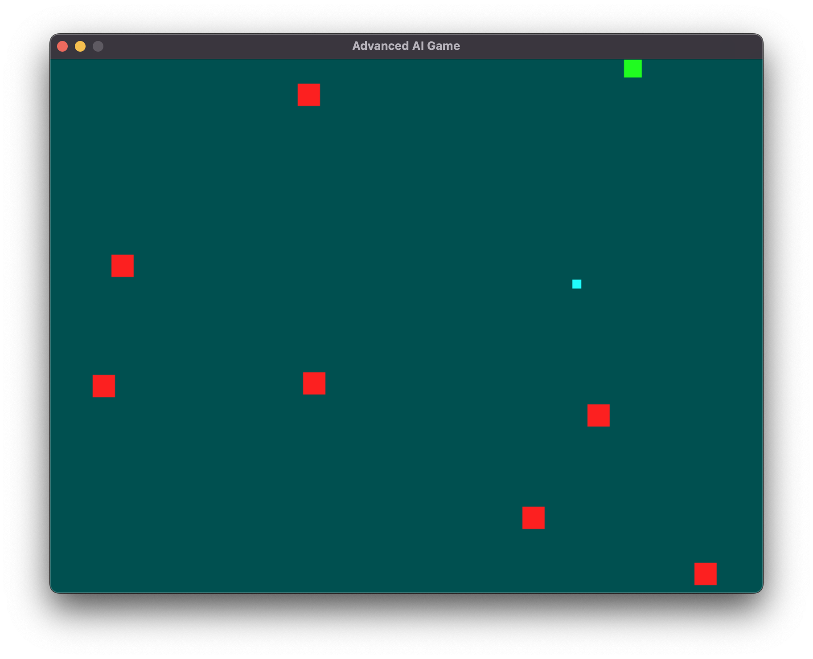

# AI Game with Reinforcement Learning

This project involves training an AI agent to play a game consisting of a player, enemies, and a goal state. The objective of the agent is to navigate the player to reach the goal state while avoiding the enemies. The game is fully observable, meaning the agent has access to all relevant information about the game state.

## Game Description

The game environment is a rectangular screen where the player, enemies, and goal state are represented as colored squares. The player, depicted as a green square, can move in four cardinal directions (up, down, left, and right). The enemies, depicted as red squares, move with a constant speed and bounce around the game screen. The goal state, depicted as a blue square, serves as the target for the player to reach.

## Agent

The AI agent acts as the player in the game and learns to make decisions based on its interactions with the environment. The agent's primary objective is to reach the goal state by maximizing its rewards. The learning process is recursive, allowing the agent to improve its performance over time.

## Actions

The agent can take four possible actions: moving left, moving right, moving up, and moving down. These actions result in a change of state in the environment.

## Observations

Observations are the information the agent receives about the game state. In this game, the observations consist of the current state of the game, including the positions of the player, enemies, and goal state.

## Reward Function

The agent receives rewards based on its actions and the resulting game state. The reward function consists of three factors: `avoid_enemy`, `goal_reward`, and `idle_penalty`. The `avoid_enemy` factor penalizes the agent for hitting an enemy (-100). The `goal_reward` factor rewards the agent for reaching the goal state (+1000). The `idle_penalty` factor penalizes the agent when the distance to the goal state remains constant (-3 + e^(-2 * distance_term)).

## Deep Q-Learning (DQL)

Deep Q-Learning is the machine learning algorithm used to train the agent in this project. It combines Q-Learning, a classic reinforcement learning algorithm, with deep neural networks. The agent learns an action-value function, called the Q-value function, which estimates the expected future reward for each action in a given state. The DQL algorithm uses a deep neural network to approximate the Q-value function and update the Q-values based on observed rewards and predicted Q-values of the next state.

## QNetwork Class

The `QNetwork` class is a neural network model used to approximate the Q-value function. It takes the current state of the environment as input and produces Q-values for all possible actions. The network consists of six fully connected layers with varying sizes, using the ReLU activation function except for the last layer.

## Results

On evaluating the trained AI agent, it reached the goal state 12 times and died 1777 times. The performance of the agent was affected by various factors, such as the game seed, game width and height, goal size, enemy count, game friction, and frames per second (FPS). Experimenting with these factors could improve or degrade the agent's performance.

### How to run
Just clone the reposiroty and run `python game.py`.